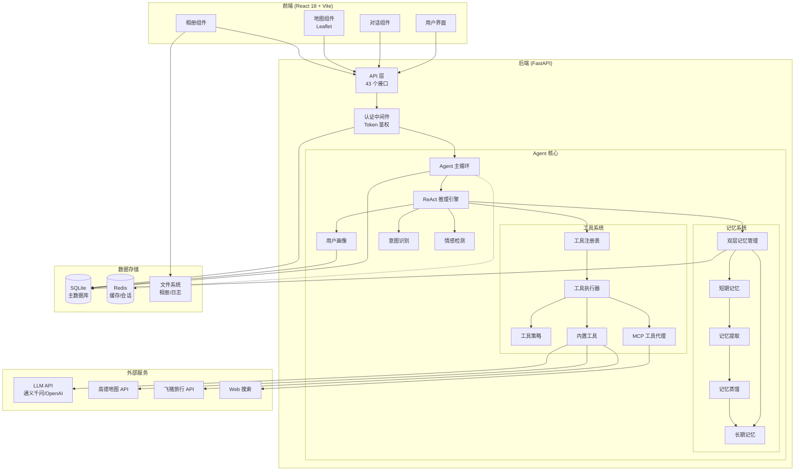

# Claw 旅行规划师

AI 驱动的智能旅行规划助手 — 实时搜索 · 智能行程 · 地图展示 · 花费统计 · 一键分享

[](https://opensource.org/licenses/MIT)
[](https://www.python.org/downloads/)
[](https://reactjs.org/)

## 在线演示

> **🚀 在线 Demo**：[https://claw-travel-demo.up.railway.app](https://claw-travel-demo.up.railway.app)
>
> 测试账号：`demo` / `demo123`（或自行注册）

---

## 功能亮点

- **AI 对话** — 基于大语言模型，自动识别旅行意图，多轮对话规划行程
- **流式输出** — SSE 流式对话，实时展示思考过程与工具调用状态
- **行程生成** — 根据需求自动生成多日行程，含景点、时间、费用、贴士
- **地图展示** — Leaflet + 高德瓦片地图，标记行程地点并绘制路线
- **花费统计** — 按天/按活动统计预算与实际花费，支持打卡记录
- **行程分享** — 生成分享链接，无需登录即可查看行程
- **行程对比** — 最多 4 个行程横向对比预算与活动
- **相册管理** — 上传旅行照片，自动提取 EXIF 地理位置，在地图上标记，AI 生成游记
- **记忆系统** — 双层记忆（短期/长期），自动提取用户偏好与旅行经验，支持记忆蒸馏
- **MCP 工具集成** — 动态选择 MCP 工具，支持 Web 搜索等外部能力扩展
- **情感检测** — 实时检测用户情绪，自动调整回复策略
- **用户画像** — 根据交互记录自动构建用户偏好标签
- **审计日志** — 记录 LLM 调用、工具执行、意图识别全链路审计事件
- **热门推荐** — 实时抓取旅行热门话题与目的地推荐
- **用户系统** — 注册/登录、Token 鉴权

---

## 系统架构



---

## 界面预览

> **📸 截图占位**：请将以下占位图替换为实际项目截图

| 对话界面 | 行程规划 |
|:---:|:---:|
|  |  |
| AI 对话与流式输出 | 多日行程自动生成 |

| 地图展示 | 相册管理 |
|:---:|:---:|
|  |  |
| 行程地点标记与路线 | 照片上传与地图标记 |

| 记忆面板 | 行程对比 |
|:---:|:---:|
|  |  |
| 用户偏好与经验记忆 | 多行程横向对比 |

**截图建议**：
1. `chat.png` — 展示 AI 对话与流式输出效果
2. `itinerary.png` — 展示生成的多日行程详情
3. `map.png` — 展示地图上的行程标记与路线
4. `album.png` — 展示相册上传与照片列表
5. `memory.png` — 展示记忆面板的长期/短期记忆
6. `compare.png` — 展示多行程对比界面

---

## 技术栈

| 层 | 技术 |
|----|------|
| 后端 | Python 3.11 · FastAPI · SQLite · OpenAI 兼容 API · 高德地图 Web服务 API |
| 前端 | React 18 · TypeScript · Vite 6 · Tailwind CSS 3 · Zustand · Leaflet · Framer Motion · React Router 7 |
| Agent | ReAct 推理循环 · 双层记忆 · 意图识别 · 情感检测 · MCP 工具代理 |
| 基础设施 | Uvicorn · Prometheus · Redis（可选） |

---

## 快速开始

### 1. 安装依赖

```bash
# 后端
python -m venv .venv
source .venv/bin/activate  # Windows: .venv\Scripts\activate
pip install -r requirements.txt

# 前端
cd frontend
npm install
```

### 2. 配置环境变量

```bash
cp .env.example .env
# 编辑 .env，填入你的 API Key
```

**必填配置**：
- `CLAW_API_KEY` — LLM API 密钥（通义千问或 OpenAI 兼容）
- `AMAP_WEBSERVICE_KEY` — 高德地图 Web服务 Key

### 3. 启动服务

```bash
# 后端（端口 8000）
uvicorn api.server:app --reload --host 0.0.0.0 --port 8000

# 前端（端口 5173，自动代理 /api 到后端）
cd frontend
npm run dev
```

打开 http://localhost:5173 即可使用。

### 4. CLI 模式

```bash
python main.py chat
```

---

## 部署指南

### 方式一：Railway（推荐）

1. Fork 本项目到 GitHub
2. 访问 [Railway](https://railway.app/)，使用 GitHub 登录
3. 点击 "New Project" → "Deploy from GitHub repo"
4. 选择你的仓库，Railway 会自动检测并构建
5. 在 "Variables" 中添加环境变量（`CLAW_API_KEY`、`AMAP_WEBSERVICE_KEY` 等）
6. 等待部署完成，获取访问链接

### 方式二：Render

1. 访问 [Render](https://render.com/)，使用 GitHub 登录
2. 点击 "New" → "Web Service"
3. 连接你的 GitHub 仓库
4. 配置构建命令：
   - **Build Command**: `pip install -r requirements.txt && cd frontend && npm install && npm run build`
   - **Start Command**: `uvicorn api.server:app --host 0.0.0.0 --port $PORT`
5. 添加环境变量，部署

### 方式三：Docker Compose（本地部署）

```bash
# 构建并启动
docker-compose up -d

# 查看日志
docker-compose logs -f

# 停止
docker-compose down
```

---

## 项目结构

```
claw7/
├── api/                    # API 路由与中间件
│   ├── server.py           # FastAPI 主文件（43 个接口）
│   └── intl_coords.py      # 国际目的地坐标库
├── core/                   # 核心业务逻辑
│   ├── agent.py            # Agent 主循环（chat / chat_stream）
│   ├── llm.py              # LLM 调用封装（OpenAI 兼容）
│   ├── reasoning.py        # ReAct 推理引擎
│   ├── prompting.py        # Prompt 构建器
│   ├── prompt_context.py   # Prompt 上下文数据类
│   ├── memory.py           # 双层记忆管理（短期/长期）
│   ├── memory_extractor.py # 记忆提取（LLM 驱动）
│   ├── memory_distiller.py # 记忆蒸馏（短期→长期）
│   ├── session.py          # 会话管理
│   ├── auth.py / token.py  # 用户认证与 Token
│   ├── trending.py         # 热门推荐
│   ├── trace.py            # 运行追踪
│   ├── runtime_facts.py    # 运行时事实（日期/时间）
│   ├── contxt_manager.py   # 上下文管理
│   ├── logging.py          # 日志配置
│   ├── logging_config.py   # JSON 结构化日志
│   ├── mcp_catalog.py      # MCP 工具目录
│   ├── itinerary/          # 行程模块（schema / repository / parser）
│   ├── album/              # 相册模块（schema / repository / service）
│   ├── intent/             # 意图识别（旅行意图分类）
│   ├── emotion/            # 情感检测
│   ├── profile/            # 用户画像
│   ├── audit/              # 审计日志（含敏感信息脱敏）
│   └── metrics/            # 监控指标（Prometheus）
├── tools/                  # 工具层
│   ├── base.py             # 工具基类（ToolSpec / ToolHandler）
│   ├── registry.py         # 工具注册表
│   ├── executor.py         # 工具执行器
│   ├── catalog.py          # 工具目录
│   ├── policy.py           # 工具策略（权限控制）
│   ├── travel.py           # 旅行工具
│   ├── amap.py             # 高德地图工具
│   ├── fliggy.py           # 飞猪工具
│   ├── http.py             # HTTP 工具
│   ├── interaction.py      # 交互工具（ask_user）
│   └── mcp.py              # MCP 代理工具
├── mcps/                   # MCP 服务器配置
│   └── web-search/         # Web 搜索 MCP
├── skills/                 # 技能定义
│   ├── amap-maps/          # 高德地图技能
│   └── fliggy-travel/      # 飞猪旅行技能
├── infra/                  # 基础设施
│   ├── db.py               # SQLite 数据库（含迁移）
│   └── health.py           # 健康检查
├── frontend/               # React 前端
│   ├── src/pages/          # 页面组件（Home / ItineraryOverview / MemoryPage / ComparePage / AlbumPage / SharedItinerary）
│   ├── src/components/     # 通用组件（Chat / Album / Itinerary）
│   ├── src/hooks/          # Zustand 状态管理
│   └── src/utils/          # 工具函数
├── tests/                  # 测试（15 个测试文件，236 个用例）
├── docs/                   # 文档
│   ├── README.md           # 详细项目说明
│   ├── API.md              # 接口文档
│   ├── album-module.md     # 相册模块说明
│   └── streaming-fix.md    # 流式输出修复记录
├── config.py               # 配置管理（pydantic-settings）
├── app.py                  # Agent 构建（依赖注入）
├── main.py                 # CLI 入口
└── .env.example            # 环境变量模板
```

---

## 环境变量

| 变量 | 必填 | 默认值 | 说明 |
|------|------|--------|------|
| `CLAW_API_KEY` | ✅ | — | LLM API 密钥 |
| `CLAW_MODEL` | ❌ | `qwen3.5-122b-a10b` | 模型名称 |
| `CLAW_BASE_URL` | ❌ | 通义千问 | OpenAI 兼容 API 地址 |
| `AMAP_WEBSERVICE_KEY` | ✅ | — | 高德地图 Web服务 Key（后端地理编码） |
| `AMAP_JS_API_KEY` | ❌ | — | 高德地图 JS API Key（前端地图展示） |
| `FLYAI_API_KEY` | ❌ | — | 飞猪旅行 API Key |
| `VITE_AMAP_KEY` | ❌ | — | 前端高德地图 Key（Vite 注入） |
| `CLAW_LOG_LEVEL` | ❌ | `DEBUG` | 日志级别 |
| `CLAW_DATABASE_PATH` | ❌ | `data/claw.db` | SQLite 数据库路径 |
| `CLAW_RATE_LIMIT_RPM` | ❌ | `60` | 每分钟请求限制 |
| `CLAW_METRICS_ENABLED` | ❌ | `true` | 是否启用 Prometheus 监控 |
| `CLAW_METRICS_PORT` | ❌ | `9090` | Prometheus 指标端口 |
| `CLAW_REDIS_URL` | ❌ | `redis://localhost:6379/0` | Redis 连接地址 |

完整配置项参见 [.env.example](.env.example)。

---

## 文档

- [项目详细说明](docs/README.md)
- [API 接口文档](docs/API.md)
- [相册模块说明](docs/album-module.md)
- [流式输出修复记录](docs/streaming-fix.md)

---

## 测试

```bash
pytest tests/ -v
```

---

## 贡献指南

欢迎提交 Issue 和 Pull Request！

1. Fork 本项目
2. 创建特性分支 (`git checkout -b feature/AmazingFeature`)
3. 提交更改 (`git commit -m 'Add some AmazingFeature'`)
4. 推送到分支 (`git push origin feature/AmazingFeature`)
5. 开启 Pull Request

---

## 许可证

[MIT](LICENSE) © 2026 Claw Contributors
