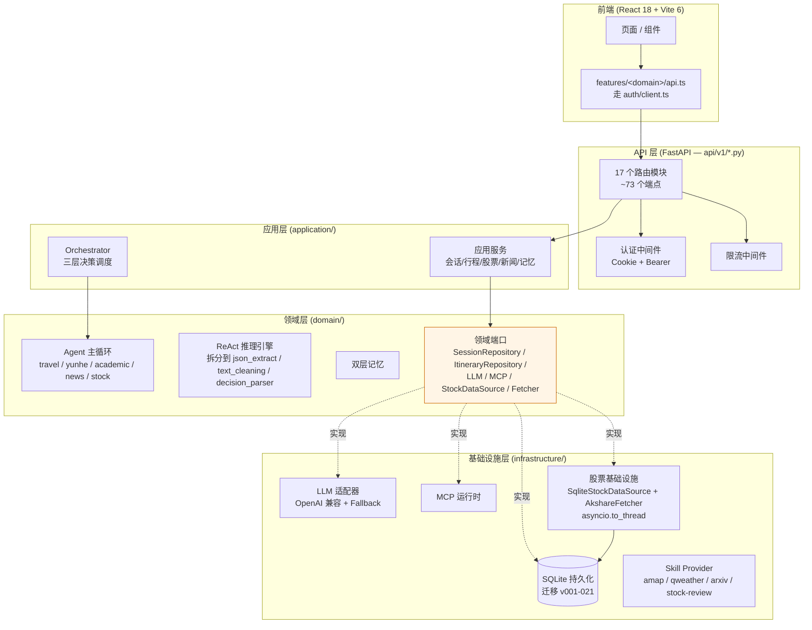

# 云合 — 通用智能体平台

通用 Agent 调度 + 领域 Agent + Skill + MCP · 智能旅行（草稿 / 存档）· 多方案对比 · 流式对话 · 地理编码 · 新闻深度研判 · A 股复盘

[](https://www.python.org/downloads/)
[](https://reactjs.org/)
[](https://fastapi.tiangolo.com/)

> **架构基线**：`docs/superpowers/specs/2026-07-16-product-and-news-agent-design.md` ·
> **执行计划**：`docs/superpowers/plans/2026-07-17-refactor-roadmap.md` ·
> **开发规范**：[AGENTS.md](AGENTS.md) ·
> **接口文档**：[docs/api/API.md](docs/api/API.md)

---

## 目录

- [功能亮点](#功能亮点)
- [业务边界（硬约束）](#业务边界硬约束)
- [系统架构](#系统架构)
- [技术栈](#技术栈)
- [前端开发指南](#前端开发指南)
- [快速开始](#快速开始)
- [部署指南](#部署指南)
- [项目结构](#项目结构)
- [环境变量](#环境变量)
- [文档](#文档)
- [测试与门禁](#测试与门禁)
- [贡献指南](#贡献指南)

---

## 功能亮点

### 通用能力

- **多智能体架构** — Orchestrator 三层决策（快路径 → function calling 委派 → 委派执行）+ 内置 Agent（yunhe / travel / academic / news / stock）+ 用户自定义 Agent，LLM 智能路由
- **AI 流式对话（SSE）** — 思考过程、工具调用状态、文本片段独立事件；新闻研判场景额外推送 `evidence` 事件
- **会话模式** — `yunhe_default`（默认调度）/ `agent_locked`（用户锁定专业 Agent）/ `news_analysis_locked`（新闻锚定，仅新闻服务可创建）
- **Skill + MCP** — 模块化技能（高德地图 / 和风天气 / arXiv 学术检索 / 张雪峰考研咨询 / 股票复盘工具集）与 MCP 工具代理
- **学术检索** — 仅限 arXiv / 论文数据库；arXiv 论文搜索、引用分析、创新点挖掘
- **记忆系统** — 双层记忆（短期 / 长期），自动提取用户偏好与旅行经验
- **审计日志** — LLM 调用、工具执行、API 边界全链路审计事件
- **LLM 降级链** — FallbackLLM 主备切换，主 provider 异常自动降级到备用 provider
- **浏览器认证** — `auth_token` HttpOnly Cookie + 独立 `csrf_token` + `X-CSRF-Token`（double-submit 模式）；前端禁止持久化长期凭据
- **非浏览器鉴权** — 仍支持 Bearer Token（仅供脚本 / CLI 场景；不走 Cookie 路径）

### 旅行

- **行程生成** — AI 对话生成多日行程；旅行 Agent 注入多方案锚点
- **多方案对比** — 一次生成"景点打卡型 + 经济实惠型"两套方案；前端双按钮 / 确认 / 撤销状态机
- **草稿 / 存档** — 用户在对话中编辑的字段进入 `manual_edit_fields`，被 Agent 保护不被覆盖；用户点击"更新信息"时查询外部数据；用户点击"确认行程"时创建不可变存档
- **行程分享** — 生成分享链接，无需登录即可查看行程
- **国际 / 国内地理编码** — 高德 + Nominatim 双源

### 新闻

- **热点池** — 后端定时抓取（15 分钟）+ 内存 / 磁盘缓存；`/news/hotspots` 只读缓存
- **深度研判** — `news_analysis_locked` 会话 + 新闻 Agent；锚点仅含标题 / 来源 / URL / 摘要 / 发布时间（不存全文）；自动产出 `verified` / `conflicted` 证据卡片 + `unverified_leads` 未核实线索
- **新闻收藏** — 收藏感兴趣的新闻话题；只存元数据，不存全文

### 股票复盘

- **大盘 / 情绪 / 板块 / 个股四维数据** — `stock_data_daily` 五表（limit_stocks_daily / market_index_daily / emotion_daily / sector_daily / stock_daily）走 SQLite 缓存
- **观察池** — 用户维护个人观察池，支持类别 / 入池价 / 备注
- **7 步思维链复盘** — 异步生成（`POST /stock/review`），通过 `GET /stock/review/tasks/{task_id}` 轮询；同 user+trade_date 幂等
- **周复盘庄股 / 抱团** — `GET /stock/correlation` 仅周复盘模式
- **后台调度** — 早盘 11:30 / 收盘 16:30 窗口 + 启动期 5 表缺失回填（warmup）

### 系统 / 管理

- **新闻来源治理** — `/admin/news` 单一系统管理员；AI 六维评分（publisher_authority / domain_brand / topic_relevance / editorial_standard / accessibility / risk_signals）+ 内置白名单
- **健康检查 / Prometheus** — `/health` / `/health/metrics`
- **限流** — 每用户 + IP 每 60 秒 60 个请求（按 API 前缀聚合）

---

## 业务边界（硬约束）

> 来自 [AGENTS.md](AGENTS.md) §3。新增 / 恢复以下功能**不予合入**：

| 禁止项 | 替代方案 |
|--------|----------|
| 情感识别 | 不做；LLM 自身回复风格处理 |
| 相册 / 照片 / EXIF | 不做；行程不存图 |
| 游记 | 不做；行程用 raw_content（Markdown） |
| 行程比较（多行程横向对比） | 多方案对比已替代（同一行程内部 sightseeing / budget） |
| 活动打卡 / 实际花费 | 不做；行程是规划快照，不是报销凭证 |
| 预订 / 支付 | 不做；不接飞猪 / 携程下单，仅保留飞猪信息查询 Skill |
| Bearer Token 主路径（浏览器） | 全部走 `auth_token` HttpOnly Cookie + `X-CSRF-Token` |
| 客户端传入 `news_analysis_locked` | 仅 `NewsService` 内部创建，前端不可传 |
| 客户端传入 `locked_agent_id='news'` | 锁定 Agent 在创建锚点会话时由后端固定 |

另：每个域名的具体业务红线见：

- 新闻：[docs/superpowers/plans/2026-07-17-news-agent-and-sources.md](docs/superpowers/plans/2026-07-17-news-agent-and-sources.md)
- 学术：[docs/superpowers/plans/2026-07-17-academic-frontend-quality.md](docs/superpowers/plans/2026-07-17-academic-frontend-quality.md)
- 旅行：[docs/superpowers/plans/2026-07-17-travel-planning.md](docs/superpowers/plans/2026-07-17-travel-planning.md)
- 股票复盘：[docs/superpowers/plans/2026-07-26-stock-review-agent.md](docs/superpowers/plans/2026-07-26-stock-review-agent.md)

---

## 系统架构


```mermaid
graph TB
    subgraph "前端 (React 18 + Vite 6)"
        UI[页面 / 组件]
        Features[features/&lt;domain&gt;/api.ts<br/>走 auth/client.ts]
    end

    subgraph "API 层 (FastAPI — api/v1/*.py)"
        API[17 个路由模块<br/>~73 个端点]
        AuthMW[认证中间件<br/>Cookie + Bearer]
        RateLimit[限流中间件]
    end

    subgraph "应用层 (application/)"
        Orchestrator[Orchestrator<br/>三层决策调度]
        Services[应用服务<br/>会话/行程/股票/新闻/记忆]
    end

    subgraph "领域层 (domain/)"
        Agents[Agent 主循环<br/>travel / yunhe / academic / news / stock]
        Reasoning[ReAct 推理引擎<br/>拆分到 json_extract / text_cleaning / decision_parser]
        Memory[双层记忆]
        Ports[领域端口<br/>SessionRepository / ItineraryRepository /<br/>LLM / MCP / StockDataSource / Fetcher]
    end

    subgraph "基础设施层 (infrastructure/)"
        SQLite[(SQLite 持久化<br/>迁移 v001-021)]
        LLMClient[LLM 适配器<br/>OpenAI 兼容 + Fallback]
        Skills[Skill Provider<br/>amap / qweather / arxiv / stock-review]
        MCP[MCP 运行时]
        Stock[股票基础设施<br/>SqliteStockDataSource + AkshareFetcher<br/>asyncio.to_thread]
    end

    UI --> Features --> API
    API --> AuthMW
    API --> RateLimit
    API --> Services
    Orchestrator --> Agents
    Services --> Ports
    Ports -.实现.-> SQLite
    Ports -.实现.-> LLMClient
    Ports -.实现.-> MCP
    Ports -.实现.-> Stock
    Stock --> SQLite

    classDef port fill:#fff5e6,stroke:#cc6600;
    class Ports port;
```

**关键约束**（[AGENTS.md](AGENTS.md) §8）：

- `app.py` 是**唯一组合根**：构造 SQLite / LLM / MCP / Skill / 缓存 / 限流 / 应用服务并显式注入端口
- `api/server.py` 只提供 `create_api(container) -> FastAPI`：注册路由 / 生命周期 / 中间件；路由不得 `new` 任何服务或仓储
- 端口先于实现：领域层需要数据库 / 网络 / LLM / MCP / 缓存 / 限流 / 密码学 / 文件系统等外部能力时，必须先在消费方所属领域包中定义 `Protocol`
- 依赖方向：domain ❌ infrastructure / api / application / fastapi；application ❌ infrastructure / api；api ❌ infrastructure；infrastructure ❌ api
- 架构守卫由 `scripts/check_architecture.py` AST 扫描实现，CI 零容忍（无 baseline / 无豁免）

---

## 技术栈

| 层 | 技术 |
|----|------|
| 后端 | Python 3.11 · FastAPI · Pydantic v2 · SQLite · OpenAI 兼容 API · 高德地图 Web 服务 API · 和风天气 API · arXiv API · akshare（A 股数据）|
| 前端 | React 18 · TypeScript strict · Vite 6 · Tailwind CSS 3 · Zustand · Leaflet · React Router 7 |
| Agent | ReAct 推理循环 · 双层记忆 · LLM 智能路由 · 5 个内置 Agent（yunhe/travel/academic/news/stock）|
| 基础设施 | Uvicorn · Prometheus · SQLite 迁移（v001–v021）· DDD 分层架构 · 端口协议 |
| 质量门禁 | ruff · mypy · bandit · pytest（≥70% 覆盖率）· pip-audit · 自研架构检查器 · gitleaks · 前端 lint/check/test/build |

---

## 前端开发指南

> **前端由其他开发者独立开发；你是后端维护者。** 以下信息帮助前端团队快速上手。

### 前端技术栈

| 类别 | 技术 |
|------|------|
| 框架 | React 18 |
| 语言 | TypeScript strict（**禁 `any`**）|
| 构建 | Vite 6 |
| 样式 | Tailwind CSS 3 |
| 状态管理 | Zustand |
| 路由 | React Router 7 |
| 地图 | Leaflet + 高德瓦片 |
| HTTP | `features/auth/client.ts`（**统一走 Cookie + CSRF**，禁止自建 fetch / axios 实例直接调 API）|

### 前端目录结构

```
frontend/
├── src/
│   ├── pages/                          # 页面（Home / ItineraryOverview / Stock / NewsAdmin / ...）
│   ├── components/                     # 通用组件（AppLayout / TrendingBar / Chat / Itinerary / ...）
│   ├── features/                       # 按域拆分的 API + 业务组件
│   │   ├── auth/client.ts              # ⚠ 统一 HTTP 入口（Cookie + CSRF）
│   │   ├── auth/api.ts
│   │   ├── chat/api.ts
│   │   ├── news/api.ts                 # hotspots / favorites / analysis-sessions
│   │   ├── stock/api.ts                # market / emotion / sector / watchlist / review
│   │   ├── travel/api.ts               # itinerary / geocode / draft-archive
│   │   ├── memory/api.ts
│   │   ├── agent/api.ts
│   │   ├── skill/api.ts
│   │   └── mcp/api.ts
│   ├── hooks/                          # Zustand store
│   ├── utils/                          # 工具函数
│   └── lib/                            # 通用库
├── vite.config.ts                      # Vite 配置（含 /api → localhost:8000 代理）
└── package.json
```

**铁律**（[AGENTS.md](AGENTS.md) §5 / §8.6）：

- 新前端 API **只能**放入 `features/<domain>/api.ts`，**必须**走 `features/auth/client.ts`
- 禁止新增 `any`、未使用导入、ESLint 禁用注释
- `utils/api.ts` 已废弃；历史代码按 `auth / chat / memory / agent / skill / mcp / news / travel` 拆分子模块

### API 调用方式

**Vite 代理**：开发环境 `frontend/vite.config.ts` 已把 `/api` 代理到 `http://localhost:8000`；前端代码直接请求 `/api/*` 即可。

**统一走 AuthClient**（`features/auth/client.ts`）：

```typescript
import { AuthClient } from '@/features/auth/client'

const http = new AuthClient()

// GET 请求：自动 credentials: 'include'，浏览器附带 auth_token cookie
const res = await http.request('/api/v1/sessions')
const data = await res.json()

// POST/PUT/PATCH/DELETE：自动从 csrf_token cookie 读取，注入 X-CSRF-Token header
const res = await http.request('/api/v1/itineraries', {
  method: 'POST',
  headers: { 'Content-Type': 'application/json' },
  body: JSON.stringify({ title: '东京5日游', destination: '东京' }),
})
```

**禁止**：

- ❌ 在 localStorage / sessionStorage 持久化任何 token
- ❌ 自行读取 cookie 中的 `auth_token`（HttpOnly，JS 读不到）
- ❌ 自行 new axios / fetch 实例直接调 API（绕过 CSRF）
- ❌ 接受客户端传入的 `news_analysis_locked` 或 `locked_agent_id='news'`

### 核心接口速览

| 接口 | 用途 | 鉴权 |
|------|------|------|
| `POST /api/v1/auth/login` | 登录（写入 `auth_token` + `csrf_token` cookie）| 公开 |
| `POST /api/v1/auth/register` | 注册 | 公开 |
| `GET /api/v1/auth/me` | 当前登录用户 | Cookie |
| `POST /api/v1/chat/stream` | **流式对话（SSE）** | Cookie |
| `GET/POST /api/v1/sessions` | 会话列表 / 创建（`mode` + `locked_agent_id`）| Cookie |
| `PATCH /api/v1/sessions/{id}/mode` | 切换会话模式 | Cookie |
| `POST /api/v1/news/hotspots/{news_id}/analysis-sessions` | 创建新闻锚定会话（**后端自动注入锚点 + 触发新闻 Agent**）| Cookie |
| `POST /api/v1/travel/drafts/{id}/refresh-preview` | 行程草稿"更新信息"（唯一外部查询入口）| Cookie |
| `POST /api/v1/travel/drafts/{id}/confirm` | 行程草稿"确认行程"（创建不可变存档）| Cookie |
| `GET /api/v1/stock/market/snapshot` | 大盘快照 | Cookie |
| `POST /api/v1/stock/review` | 触发股票复盘（异步，7 步思维链）| Cookie |
| `GET /api/v1/stock/review/tasks/{task_id}` | 复盘任务状态（轮询）| Cookie |
| `GET /api/v1/admin/news/sources` | 新闻来源列表 | 管理员 Cookie |
| `GET /health` | 健康检查 | 公开 |
| `GET /api/v1/news/trending` | 旅行热门 | 公开 |
| `GET /api/v1/share/{token}` | 分享行程 | 公开 |

> 📘 **完整 API 文档（73+ 端点）**：[docs/api/API.md](docs/api/API.md) — 含 TypeScript 类型定义、SSE 事件清单、错误码、Cookie + CSRF 客户端实现示例、Bearer Token（非浏览器场景）说明。

---

## 快速开始

### 后端启动

```powershell
# 1. 创建虚拟环境
python -m venv .venv
# Windows: .venv\Scripts\activate  |  macOS/Linux: source .venv/bin/activate

# 2. 安装依赖（锁定版本）
python -m pip install -r requirements.lock

# 3. 准备环境变量
cp config/.env.example .env
# 编辑 .env，至少填入 YUNHE_API_KEY 和 AMAP_WEBSERVICE_KEY；
# 新闻来源治理：YUNHE_ADMIN_USERNAME

# 4. 启动（开发模式）
uvicorn api.server:app --reload --host 0.0.0.0 --port 8000
```

启动期后台任务（lifespan）：

- 热搜池首刷（`refresh_pool`）
- 内存新闻白名单 idempotent 注册（`BUILTIN_WHITELIST`）
- 记忆维护 / 热点池刷新（每 15 分钟）/ 清理（每 6 小时）
- 股票复盘早盘 11:30 / 收盘 16:30 轮询
- 股票缓存 5 表缺失回填（后台任务，**不阻塞 ready**；详见 `YUNHE_STOCK_WARMUP_*` 配置）

### 前端启动

```bash
cd frontend
npm --prefix frontend ci      # 锁定依赖
npm --prefix frontend run dev # 端口 5173，自动代理 /api → localhost:8000
```

打开 http://localhost:5173 即可使用。

---

## 部署指南

### 方式一：Render

1. 访问 [Render](https://render.com/)，使用 GitHub 登录
2. 点击 "New" → "Web Service"
3. 连接你的 GitHub 仓库
4. 配置构建命令：
   - **Build Command**: `pip install -r requirements.lock && cd frontend && npm ci && npm run build`
   - **Start Command**: `uvicorn api.server:app --host 0.0.0.0 --port $PORT`
5. 在 Environment 中填入环境变量（`YUNHE_API_KEY` / `AMAP_WEBSERVICE_KEY` / `YUNHE_ADMIN_USERNAME` 等）
6. 部署

### 方式二：Railway

1. Fork 本项目到 GitHub
2. 访问 [Railway](https://railway.app/)，使用 GitHub 登录
3. "New Project" → "Deploy from GitHub repo"
4. 选择仓库，Railway 自动检测并构建
5. 在 Variables 中添加环境变量
6. 等待部署完成

### 方式三：本地部署

```powershell
# Windows
.\start.ps1

# Linux / macOS
chmod +x start.sh && ./start.sh
```

> 生产环境务必设置 `YUNHE_ENVIRONMENT=production`（开启 Secure cookie + fail-fast）。

---

## 项目结构

```text
yunhe/
├── api/                            # API 层：协议、认证、响应
│   ├── server.py                   # FastAPI 主入口（lifespan + 中间件 + 路由挂载）
│   ├── v1/                         # 17 个路由模块
│   │   ├── auth.py · chat.py · session.py · agent.py · skill.py · mcp.py
│   │   ├── itinerary.py · travel.py · geocode.py · share.py
│   │   ├── memory.py · feedback.py · health.py · debug.py
│   │   ├── news.py · admin_news.py · stock.py
│   │   └── __init__.py             # 聚合 v1_router
│   ├── middleware/                 # 认证 + 限流 + 错误处理
│   └── intl_coords.py              # 国际目的地坐标库
├── application/                    # 应用层：DTO、用例、调度、应用服务
│   ├── builtin_agents/             # 内置 Agent YAML（yunhe/travel/academic/news/stock）
│   ├── news/                       # 新闻分析、来源治理、锚点注入
│   ├── stock/                      # 股票复盘服务
│   ├── travel/                     # 旅行草稿 / 存档服务
│   ├── session/                    # 会话服务 + confirm-plan 协调
│   ├── authz.py                    # 对象级授权
│   ├── scheduler.py                # 后台调度
│   └── trending/                   # 热门推荐
├── domain/                         # 领域层：领域模型、端口、Agent 编排
│   ├── agent/                      # DynamicAgent + 内置 Agent 注册
│   ├── news/                       # NewsSource / NewsItem / 端口
│   ├── stock/                      # StockDataSource 端口 + 领域模型
│   ├── travel/                     # 行程 / 草稿 / 存档 / 工具
│   ├── memory/                     # 双层记忆管理
│   ├── user/                       # 认证
│   ├── reasoning/                  # ReAct 推理引擎（已拆分）
│   └── shared/                     # 审计 / 监控 / 限流
├── infrastructure/                 # 基础设施层：外部 I/O
│   ├── persistence/                # SQLite（connection / schema / migrations / serialization）
│   ├── llm/                        # OpenAI 兼容客户端 + FallbackLLM
│   ├── skills/builtin/             # 内置 Skill（amap/qweather/arxiv/stock-review/...）
│   ├── mcp/                        # MCP 运行时 + 目录
│   ├── stock/                      # SqliteStockDataSource + AkshareFetcher（asyncio.to_thread）
│   ├── news/                       # 数据源 fetcher（baidu/toutiao/weibo/zhihu）
│   └── external/                   # 其他外部服务
├── config/                         # 配置（Pydantic Settings）
├── frontend/                       # React 前端
│   ├── src/features/<domain>/      # 按域拆分的 API 模块
│   ├── src/features/auth/client.ts # 统一 Cookie + CSRF HTTP 客户端
│   ├── src/pages/ · components/ · hooks/
│   └── package.json
├── tests/                          # unit/ · integration/ · e2e/
├── docs/                           # 产品设计 / 计划 / 接口文档
│   ├── api/API.md                  # 完整接口文档
│   ├── superpowers/specs/          # 产品基线设计
│   └── superpowers/plans/          # 重构与领域实施计划
├── scripts/                        # check_architecture.py 等门禁脚本
├── app.py                          # 唯一组合根（build_container）
├── AGENTS.md                       # 开发规范（v3.1）
├── start.ps1 / start.sh            # 启动脚本
└── requirements.lock               # Python 锁定依赖
```

---

## 环境变量

| 变量 | 必填 | 默认值 | 说明 |
|------|------|--------|------|
| `YUNHE_API_KEY` | ✅ | — | LLM API 密钥 |
| `YUNHE_MODEL` | ❌ | `qwen3.5-122b-a10b` | 模型名称 |
| `YUNHE_BASE_URL` | ❌ | 通义千问 DashScope | OpenAI 兼容 API 地址 |
| `YUNHE_FALLBACK_API_KEY` | ❌ | — | LLM 降级备用 API 密钥（启用 FallbackLLM）|
| `YUNHE_FALLBACK_BASE_URL` | ❌ | — | LLM 降级备用 API 地址 |
| `YUNHE_FALLBACK_MODEL` | ❌ | — | LLM 降级备用模型名称 |
| `AMAP_WEBSERVICE_KEY` | ✅ | — | 高德地图 Web 服务 Key（地理编码 / Skill）|
| `AMAP_JS_API_KEY` | ❌ | — | 高德地图 JS API Key（前端）|
| `WEATHER_API_KEY` | ❌ | — | 和风天气 API Key（旅行天气查询）|
| `YUNHE_ADMIN_USERNAME` | ❌ | — | 启动期解析为 admin_user_id；**生产环境必须配置**（管理 `/admin/news/*`）|
| `YUNHE_ENVIRONMENT` | ❌ | `development` | `production` 启用 Secure cookie + fail-fast |
| `YUNHE_LOG_LEVEL` | ❌ | `DEBUG` | 日志级别 |
| `YUNHE_DATABASE_PATH` | ❌ | `data/yunhe.db` | SQLite 数据库路径 |
| `YUNHE_RATE_LIMIT_RPM` | ❌ | `60` | 每分钟请求限制 |
| `YUNHE_METRICS_ENABLED` | ❌ | `true` | 是否启用 Prometheus 监控 |
| `YUNHE_METRICS_PORT` | ❌ | `9090` | Prometheus 指标端口 |
| `YUNHE_REDIS_URL` | ❌ | `redis://localhost:6379/0` | Redis 连接地址 |
| `YUNHE_AUDIT_ENABLED` | ❌ | `true` | 是否启用审计日志 |
| `YUNHE_AUDIT_RETENTION_DAYS` | ❌ | `30` | 审计日志保留天数 |
| `YUNHE_MAX_ITERATIONS` | ❌ | `15` | Agent 最大推理轮次 |
| `YUNHE_MEMORY_DISTILL_THRESHOLD` | ❌ | `2` | 记忆蒸馏阈值 |
| `YUNHE_STOCK_WARMUP_WINDOW_DAYS` | ❌ | `15` | 启动期股票缓存回填窗口（自然日数，1-60）|
| `YUNHE_STOCK_WARMUP_TIMEOUT_SECONDS` | ❌ | `300` | 启动期股票缓存回填总超时（秒，10-3600）|

完整配置项参见 [config/.env.example](config/.env.example) / [config/settings.py](config/settings.py)。

---

## 文档

| 文档 | 说明 |
|------|------|
| [docs/api/API.md](docs/api/API.md) | 完整接口文档（79 端点；Cookie + CSRF / Bearer 双模式；TypeScript 类型）|
| [AGENTS.md](AGENTS.md) | 开发规范 v3.1（业务边界 / 安全 / 架构守卫 / 测试与 CI）|
| [docs/superpowers/specs/2026-07-16-product-and-news-agent-design.md](docs/superpowers/specs/2026-07-16-product-and-news-agent-design.md) | 产品业务基线 |
| [docs/superpowers/plans/2026-07-17-refactor-roadmap.md](docs/superpowers/plans/2026-07-17-refactor-roadmap.md) | 重构执行顺序 |
| [docs/superpowers/plans/2026-07-17-news-agent-and-sources.md](docs/superpowers/plans/2026-07-17-news-agent-and-sources.md) | 新闻 Agent + 来源治理 |
| [docs/superpowers/plans/2026-07-17-academic-frontend-quality.md](docs/superpowers/plans/2026-07-17-academic-frontend-quality.md) | 学术智能体 |
| [docs/superpowers/plans/2026-07-17-travel-planning.md](docs/superpowers/plans/2026-07-17-travel-planning.md) | 旅行草稿 / 存档 |
| [docs/superpowers/plans/2026-07-17-platform-and-routing.md](docs/superpowers/plans/2026-07-17-platform-and-routing.md) | 平台 + 路由 |
| [docs/superpowers/plans/2026-07-25-architecture-cleanup.md](docs/superpowers/plans/2026-07-25-architecture-cleanup.md) | 架构清理 P0–P7 |
| [docs/superpowers/plans/2026-07-26-stock-review-agent.md](docs/superpowers/plans/2026-07-26-stock-review-agent.md) | 股票复盘 Agent |

---

## 测试与门禁

> 任何 PR 必须通过以下门禁（[AGENTS.md](AGENTS.md) §6）：

```powershell
# Python
python -m pip install -r requirements.lock
python scripts/check_architecture.py          # 架构检查（零容忍，无 baseline）
python -m ruff check .
python -m mypy api application domain infrastructure
python -m bandit -r api application domain infrastructure -lll
python -m pytest --cov=api --cov=application --cov=domain --cov=infrastructure --cov-fail-under=70
python -m pip_audit -r requirements.lock

# Frontend
npm --prefix frontend ci
npm --prefix frontend run lint
npm --prefix frontend run check
npm --prefix frontend run test
npm --prefix frontend run build
```

`.github/workflows/ci.yml` 阻断式执行上述检查（包含 gitleaks）。

**单元测试** 不得访问真实网络或生产数据；使用 fake / stub / mock。

---

## 贡献指南

1. Fork 本项目
2. 创建特性分支（`git checkout -b feature/AmazingFeature`）
3. **每个行为变更**：先写失败测试 → 最小实现 → 跑门禁 → 独立 commit
4. 提交前运行与变更匹配的命令并贴出实际输出
5. 推送分支（`git push origin feature/AmazingFeature`）
6. 开启 Pull Request

详见 [AGENTS.md](AGENTS.md) §7 工作方式。

---

## 许可证

Private © 2026 云合 Contributors
